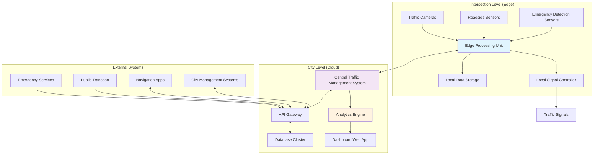

# Design Document: Intelligent Traffic Signal Control System

## Overview

The Intelligent Traffic Signal Control System is a comprehensive AI-powered solution that transforms traditional fixed-timer traffic signals into adaptive, intelligent systems. The system leverages computer vision, machine learning, and real-time data processing to optimize traffic flow, prioritize emergency vehicles, and provide actionable insights for urban planning.

The architecture follows a distributed edge-cloud hybrid approach, where edge devices handle real-time traffic control decisions while cloud services provide centralized management, analytics, and coordination across multiple intersections.

## Architecture

### System Architecture Diagram



### Deployment Architecture

The system supports three deployment models:

1. **Edge-Only Deployment**: For single intersections or small deployments
2. **Hybrid Edge-Cloud**: For city-wide deployments with centralized management
3. **Full Cloud**: For maximum scalability and analytics capabilities

## Components and Interfaces

### 1. Traffic Monitoring Component

**Purpose**: Real-time traffic analysis using computer vision and sensor fusion

**Key Technologies**:
- YOLOv8 for vehicle detection and classification
- OpenCV for video processing
- Sensor fusion algorithms for multi-modal data integration

**Interfaces**:
- Input: Video streams from traffic cameras, sensor data from roadside units
- Output: Traffic density metrics, vehicle counts, queue lengths, vehicle classifications

**Core Functions**:
- Vehicle detection and tracking across multiple lanes
- Traffic density calculation using computer vision algorithms
- Vehicle type classification (cars, buses, trucks, motorcycles, bicycles)
- Queue length estimation using spatial analysis
- Real-time processing with sub-2-second latency

### 2. AI Signal Optimization Engine

**Purpose**: Dynamic traffic signal timing optimization using reinforcement learning

**Key Technologies**:
- Reinforcement Learning (Deep Q-Network and Actor-Critic methods)
- Adaptive Traffic Signal Control (ATSC) algorithms
- Multi-agent coordination for intersection networks

**Interfaces**:
- Input: Real-time traffic data, historical patterns, intersection topology
- Output: Optimal signal timing plans, phase durations, cycle lengths

**Core Algorithms**:
- **Turn-based Agent**: Prioritizes directions with higher traffic density
- **Time-based Agent**: Adjusts phase durations based on real-time conditions
- **Network Coordination**: Optimizes signal timing across connected intersections
- **Learning System**: Continuously improves performance using historical data

### 3. Emergency Vehicle Detection System

**Purpose**: Real-time detection and prioritization of emergency vehicles

**Key Technologies**:
- YOLOv8 trained on emergency vehicle datasets
- Audio signal processing for siren detection
- Multi-modal fusion for improved accuracy

**Interfaces**:
- Input: Video streams, audio feeds, transponder signals
- Output: Emergency vehicle alerts, priority requests, vehicle type classification

**Detection Methods**:
- **Visual Recognition**: Detection of emergency lights, vehicle markings, and shapes
- **Audio Analysis**: Siren pattern recognition and localization
- **Transponder Integration**: Support for emergency vehicle transponders
- **Multi-modal Fusion**: Combines visual, audio, and transponder data for robust detection

### 4. Signal Control Interface

**Purpose**: Hardware abstraction layer for traffic signal control

**Interfaces**:
- Input: Signal timing commands from AI engine
- Output: Physical signal state changes, status feedback

**Protocols Supported**:
- NTCIP (National Transportation Communications for ITS Protocol)
- SNMP for device management
- Custom protocols for legacy signal controllers

**Safety Features**:
- Minimum/maximum timing constraints
- Conflict detection and prevention
- Automatic fallback to fixed timing on system failure
- Hardware watchdog integration

### 5. Central Management System

**Purpose**: Centralized coordination and management of multiple intersections

**Key Components**:
- **Intersection Manager**: Coordinates multiple signal controllers
- **Configuration Service**: Manages system settings and parameters
- **Monitoring Service**: Real-time system health and performance monitoring
- **Alert System**: Incident detection and notification

**Interfaces**:
- REST APIs for external system integration
- WebSocket connections for real-time data streaming
- MQTT for IoT device communication

### 6. Analytics and Reporting Engine

**Purpose**: Traffic data analysis and insight generation

**Key Features**:
- Real-time traffic flow analysis
- Historical trend identification
- Performance metrics calculation
- Environmental impact assessment

**Analytics Capabilities**:
- Traffic volume and density analysis
- Average waiting time calculations
- Fuel consumption and emission estimates
- Emergency response time improvements
- System performance metrics

### 7. Web Dashboard

**Purpose**: User interface for traffic management and system monitoring

**Key Features**:
- Real-time intersection monitoring with live camera feeds
- Interactive city map with traffic status visualization
- Manual signal override capabilities
- Alert management and incident response
- Report generation and export functionality

**User Roles**:
- **Traffic Operators**: Real-time monitoring and control
- **City Planners**: Analytics and reporting access
- **System Administrators**: Configuration and maintenance
- **Emergency Coordinators**: Priority override capabilities

## Data Models

### Traffic Data Model

```typescript
interface TrafficData {
  intersectionId: string;
  timestamp: Date;
  lanes: LaneData[];
  overallDensity: number;
  averageSpeed: number;
  queueLengths: number[];
}

interface LaneData {
  laneId: string;
  vehicleCount: number;
  vehicleTypes: VehicleTypeCount[];
  averageSpeed: number;
  queueLength: number;
  density: number;
}

interface VehicleTypeCount {
  type: 'car' | 'bus' | 'truck' | 'motorcycle' | 'bicycle';
  count: number;
}
```

### Signal State Model

```typescript
interface SignalState {
  intersectionId: string;
  timestamp: Date;
  phases: PhaseState[];
  currentPhase: number;
  cycleLength: number;
  emergencyOverride: boolean;
}

interface PhaseState {
  phaseId: number;
  duration: number;
  minDuration: number;
  maxDuration: number;
  directions: Direction[];
}

interface Direction {
  approach: string;
  movement: 'through' | 'left' | 'right';
  state: 'green' | 'yellow' | 'red';
}
```

### Emergency Vehicle Model

```typescript
interface EmergencyVehicle {
  vehicleId: string;
  type: 'ambulance' | 'fire_truck' | 'police';
  location: GeoLocation;
  direction: number;
  speed: number;
  priority: number;
  estimatedArrival: Date;
  detectionConfidence: number;
}

interface EmergencyEvent {
  eventId: string;
  intersectionId: string;
  vehicle: EmergencyVehicle;
  detectionTime: Date;
  responseTime: number;
  signalOverrideTime: number;
  clearanceTime: Date;
}
```

### Analytics Model

```typescript
interface TrafficAnalytics {
  intersectionId: string;
  period: TimePeriod;
  metrics: TrafficMetrics;
  comparisons: PerformanceComparison;
  environmentalImpact: EnvironmentalMetrics;
}

interface TrafficMetrics {
  averageWaitTime: number;
  throughput: number;
  peakHours: TimeRange[];
  congestionLevel: number;
  emergencyResponseTime: number;
}

interface EnvironmentalMetrics {
  fuelSavings: number;
  emissionReduction: number;
  idleTimeReduction: number;
  co2Reduction: number;
}
```

### Configuration Model

```typescript
interface IntersectionConfig {
  intersectionId: string;
  location: GeoLocation;
  topology: IntersectionTopology;
  signalConfig: SignalConfiguration;
  aiConfig: AIConfiguration;
  emergencyConfig: EmergencyConfiguration;
}

interface AIConfiguration {
  algorithm: 'turn_based' | 'time_based' | 'hybrid';
  learningRate: number;
  explorationRate: number;
  rewardFunction: RewardParameters;
  updateFrequency: number;
}
```

## Correctness Properties

*A property is a characteristic or behavior that should hold true across all valid executions of a system—essentially, a formal statement about what the system should do. Properties serve as the bridge between human-readable specifications and machine-verifiable correctness guarantees.*

### Property 1: Real-time Traffic Monitoring Performance
*For any* traffic intersection with active sensors, when vehicles are detected, the Traffic_Monitor should analyze and update traffic density within the specified time constraints (2 seconds for analysis, 5 seconds for updates) while capturing all required data fields for each lane.
**Validates: Requirements 1.1, 1.2, 1.3**

### Property 2: Vehicle Classification Accuracy
*For any* vehicle detection event, the Traffic_Monitor should correctly classify the vehicle type as one of the supported categories (car, bus, truck, motorcycle, bicycle) with consistent accuracy across different lighting and weather conditions.
**Validates: Requirements 1.5**

### Property 3: Fault-Tolerant Monitoring
*For any* sensor failure scenario, the Traffic_Monitor should automatically switch to backup sensors and maintain continuous operation without data loss or service interruption.
**Validates: Requirements 1.4**

### Property 4: Adaptive Signal Timing Optimization
*For any* traffic condition scenario, the Signal_Controller should adjust timing within specified bounds (up to 50% extension for high density, minimum intervals for light traffic) while prioritizing directions with highest traffic density.
**Validates: Requirements 2.1, 2.2, 2.4**

### Property 5: Signal Timing Safety Constraints
*For any* signal timing calculation, the system should never violate safety constraints (minimum 15 seconds green, maximum 120 seconds red) regardless of traffic conditions or AI optimization decisions.
**Validates: Requirements 2.5**

### Property 6: Emergency Vehicle Priority Response
*For any* emergency vehicle detection within 200 meters, the system should complete the full priority workflow (detect within 3 seconds, immediately switch signals, resume normal operation within 10 seconds of passage) while respecting vehicle type hierarchy.
**Validates: Requirements 3.1, 3.2, 3.3, 3.5**

### Property 7: Multi-Modal Emergency Detection
*For any* emergency vehicle, the Emergency_Detector should use all available detection methods (visual recognition of lights/markings, siren detection, transponder signals) to ensure robust identification across different environmental conditions.
**Validates: Requirements 3.4**

### Property 8: Real-Time Dashboard Functionality
*For any* connected intersection, the Central_Dashboard should display real-time status, live camera feeds, and provide manual override capabilities while maintaining responsive performance across all connected intersections.
**Validates: Requirements 4.1, 4.3, 4.4**

### Property 9: Anomaly Detection and Alerting
*For any* traffic anomaly or system component failure, the system should detect the issue and alert operators within 30 seconds while clearly indicating fault status and affected intersections.
**Validates: Requirements 4.2, 4.5**

### Property 10: Comprehensive Analytics Generation
*For any* intersection and time period, the Traffic_Analytics_Engine should generate complete reports containing all specified metrics (traffic patterns, waiting times, fuel savings, emissions) in both PDF and CSV formats.
**Validates: Requirements 5.1, 5.2, 5.3, 5.4, 8.2**

### Property 11: Historical Data Retention
*For any* traffic data collected, the system should maintain it in accessible form for the minimum required retention period (2 years) while supporting efficient querying and analysis.
**Validates: Requirements 5.5**

### Property 12: System Scalability
*For any* deployment scale (single intersection to city-wide), the system should maintain consistent performance and functionality while supporting dynamic addition of new intersections without disrupting existing operations.
**Validates: Requirements 6.1, 6.3**

### Property 13: Infrastructure Compatibility
*For any* existing traffic signal infrastructure, the system should integrate with minimal hardware upgrades while supporting both cloud-based and on-premise deployment options.
**Validates: Requirements 6.2, 6.4**

### Property 14: Automatic Failover and Recovery
*For any* AI component failure or network connectivity loss, the Signal_Controller should automatically switch to backup operation modes and restore normal AI operation when components are repaired.
**Validates: Requirements 7.1, 7.2, 7.5**

### Property 15: Performance Improvement Measurement
*For any* traffic scenario comparison, the system should demonstrate measurable improvements (minimum 30% reduction in waiting times) while accurately measuring and reporting idling time reductions and environmental benefits.
**Validates: Requirements 8.1, 8.3**

### Property 16: Environmental Optimization
*For any* high pollution period, the system should adjust its optimization strategy to prioritize traffic flow improvements while generating accurate monthly environmental impact reports.
**Validates: Requirements 8.4, 8.5**

### Property 17: Data Security and Privacy Protection
*For any* data transmission or storage operation, the system should use AES-256 encryption, anonymize vehicle identification information, and ensure no personally identifiable information is captured or stored.
**Validates: Requirements 9.1, 9.2, 9.3**

### Property 18: Secure Access Control and Auditing
*For any* system access or configuration change, the system should require proper authentication and maintain complete audit logs of all activities.
**Validates: Requirements 9.4, 9.5**

### Property 19: External System Integration
*For any* integration with external systems (city management, public transport, navigation apps, incident management), the system should provide secure APIs and proper protocol support (REST, NTCIP, SNMP) while maintaining data security.
**Validates: Requirements 10.1, 10.2, 10.4, 10.5**

### Property 20: Public Transport Priority Integration
*For any* public transport vehicle at designated stops, when integrated with transit systems, the system should provide appropriate priority while maintaining overall traffic flow optimization.
**Validates: Requirements 10.3**

## Error Handling

### Traffic Monitoring Errors
- **Sensor Failures**: Automatic failover to backup sensors with graceful degradation
- **Camera Obstructions**: Alert generation and alternative data source utilization
- **Network Connectivity Issues**: Local operation mode with data synchronization upon reconnection
- **Data Corruption**: Data validation and error correction using redundant sources

### AI Algorithm Errors
- **Model Prediction Failures**: Fallback to rule-based timing algorithms
- **Learning Algorithm Convergence Issues**: Reset to known good parameters with gradual re-learning
- **Resource Exhaustion**: Dynamic resource allocation and priority-based processing
- **Invalid Timing Calculations**: Safety constraint enforcement and default timing application

### Emergency Detection Errors
- **False Positives**: Confidence threshold tuning and multi-modal verification
- **Missed Detections**: Redundant detection methods and manual override capabilities
- **Conflicting Priorities**: Clear hierarchy enforcement and conflict resolution algorithms
- **System Response Delays**: Performance monitoring and automatic system optimization

### Hardware and Infrastructure Errors
- **Signal Controller Failures**: Automatic fallback to backup controllers or manual operation
- **Power Outages**: Battery backup systems and graceful shutdown procedures
- **Communication Failures**: Store-and-forward mechanisms and offline operation modes
- **Database Failures**: Data replication and automatic failover to backup systems

## Testing Strategy

### Dual Testing Approach

The system requires both unit testing and property-based testing to ensure comprehensive coverage:

**Unit Tests** focus on:
- Specific examples of traffic scenarios and expected responses
- Edge cases like extreme weather conditions or unusual traffic patterns
- Integration points between system components
- Error conditions and recovery mechanisms
- Specific emergency vehicle detection scenarios

**Property-Based Tests** focus on:
- Universal properties that must hold across all possible inputs
- Comprehensive input coverage through randomization
- System behavior under varying traffic conditions
- Performance characteristics across different scales
- Security and privacy properties across all data operations

### Property-Based Testing Configuration

**Testing Framework**: Use Hypothesis (Python) or fast-check (TypeScript) for property-based testing
**Test Configuration**: Minimum 100 iterations per property test to ensure statistical significance
**Test Tagging**: Each property test must reference its design document property using the format:
- **Feature: intelligent-traffic-signal-control, Property {number}: {property_text}**

### Testing Categories

**Performance Testing**:
- Response time properties for traffic monitoring and emergency detection
- Throughput testing for high-traffic scenarios
- Scalability testing across different deployment sizes
- Resource utilization under various load conditions

**Functional Testing**:
- Traffic optimization algorithm correctness
- Emergency vehicle priority workflow validation
- Dashboard functionality and user interface testing
- Analytics calculation accuracy and report generation

**Security Testing**:
- Data encryption and privacy protection validation
- Authentication and authorization testing
- API security and access control verification
- Audit logging completeness and integrity

**Integration Testing**:
- External system integration validation
- Protocol compliance testing (NTCIP, SNMP)
- Multi-intersection coordination testing
- Failover and recovery scenario validation

**Reliability Testing**:
- Fault injection and recovery testing
- Long-running stability testing
- Network partition and reconnection testing
- Hardware failure simulation and response validation

### Test Data Management

**Synthetic Data Generation**: Create realistic traffic scenarios using statistical models
**Real-World Data Integration**: Use anonymized traffic data from partner cities for validation
**Emergency Scenario Simulation**: Comprehensive emergency vehicle detection test cases
**Environmental Condition Simulation**: Testing under various weather and lighting conditions

The testing strategy ensures that both specific examples work correctly (unit tests) and that universal properties hold across all possible system states (property tests), providing comprehensive validation of system correctness and reliability.